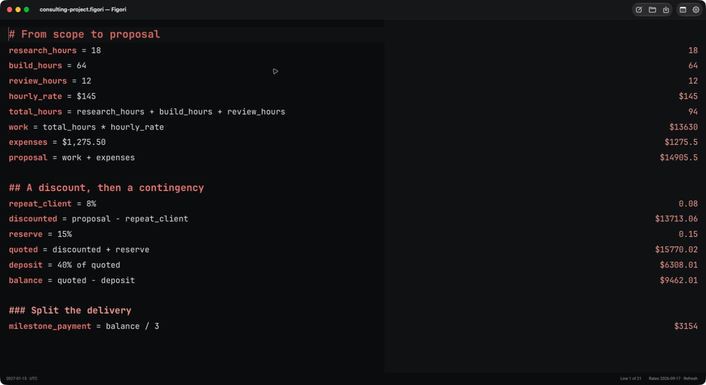
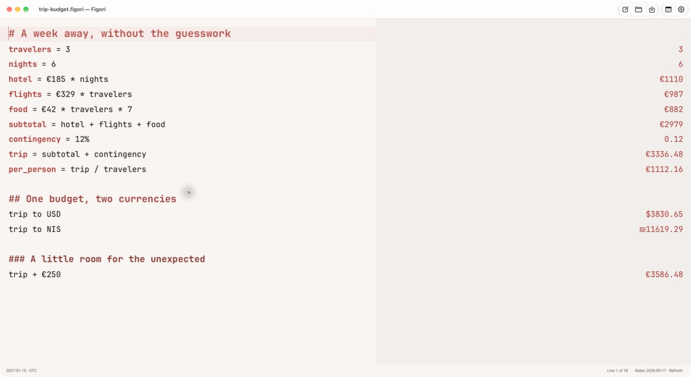
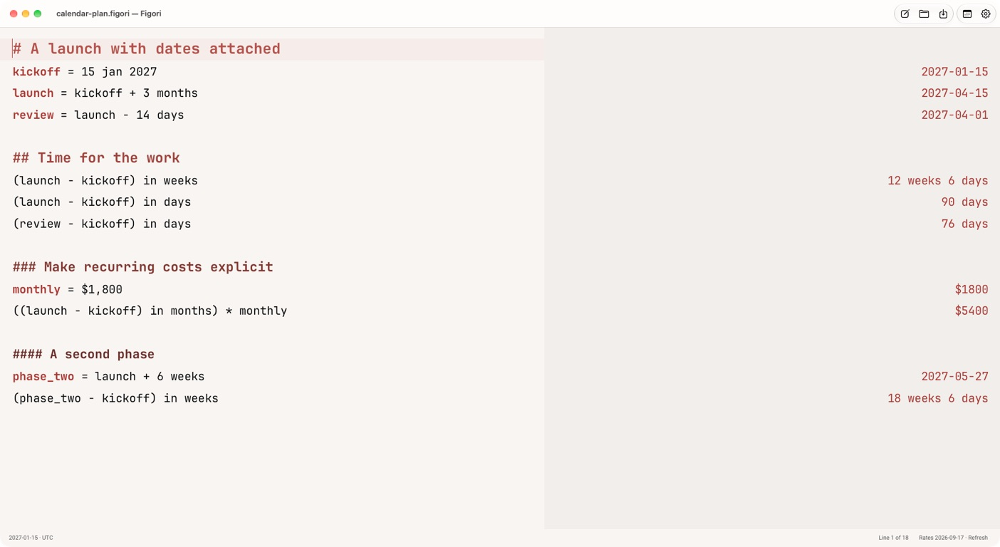

<picture>
  <source media="(prefers-color-scheme: dark)" srcset="assets/brand/figori-lockup-inverse.svg">
  
</picture>

# Figori

**Figori by BeFeast — Your numbers, in context.**

A local-first calculator worksheet with a **standalone desktop app**, plus Raycast, terminal and Omarchy integrations. Write calculations beside your notes and see results beside each line, with the date anchor, timezone and currency basis behind the answer.

## A worksheet, in practice



Build a proposal from named values, explore a trip budget in multiple currencies, or connect launch dates to recurring costs. These are real native app captures of public synthetic examples, not mockups.

<details>
<summary>Travel budget and calendar planning</summary>





</details>

Try the [consulting](site/examples/consulting-project.figori), [travel](site/examples/trip-budget.figori), and [calendar](site/examples/calendar-plan.figori) worksheets. Example values are illustrative; currency conversions use the dated snapshot shown in the app.

[Download for macOS Apple silicon](https://github.com/BeFeast/figori/releases/download/v0.3.6/Figori-0.3.6-macos-arm64.dmg) · [Product website](https://figori.befeast.com) · [Public source](https://github.com/BeFeast/figori)

## Inspired by Numi

Figori is inspired by [Numi](https://numi.app), the thoughtful natural-language calculator created by the [Numi developer](https://github.com/nikolaeu/numi). Numi helped establish the writing-and-calculating experience this project builds on. **Please visit [the official Numi website](https://numi.app) to try Numi and support its original developer.**

Figori uses an independent calculation engine. It supports **UTF-8 plain-text `.numi` import/export** and captured Markdown worksheets, while deliberately choosing its own calendar semantics. File interoperability does not promise every Numi expression or identical numerical results.

## What Figori does

- **Calendar-aware calculation:** distinguish calendar dates, zoned instants and elapsed durations. Calendar months and years keep their calendar meaning.
- **Visible context:** unanchored date conversions use dynamic today; pin another date and choose an IANA timezone when needed.
- **Whole monthly periods:** count completed rental-anchored months, optionally including the trailing incomplete period. No hidden default proration.
- **One shared engine:** TypeScript + Temporal across the desktop app, Raycast, terminal and the native Omarchy panel.
- **Local worksheets:** preserve headings, Unicode, assignments, unsupported lines and diagnostics. Atomic saves and recovery copies retain your work.
- **Explicit exchange rates:** refresh the public ECB ILS/USD pair through Frankfurter, then use its cached snapshot offline with visible source/date/status. No worksheet content is sent to the rate provider.

## Quickstart

The standalone app provides a multiline worksheet editor, inline results and native file open/save. Build the current macOS app from source using the [desktop build guide](docs/desktop-build.md); desktop release and GUI acceptance status are recorded separately from CLI releases.

Download the CLI for your platform from [Releases](https://git.oklabs.uk/BeFeast/figori/releases) and follow the [installation guidance](docs/releases.md).

```sh
figori '13 may 2022 + 9 months'
figori --anchor 2024-02-01 '1 month in days'
figori --tui
```

Preview status and platform notes accompany each release.

## Numi files and intentional differences

Native assignment syntax such as `price = 12` remains an assignment. Captured Markdown expressions with historical `= result` values are imported separately; old results are comparison snapshots, not current answers. Imports preserve source files. CLI exports refuse existing destinations by default; the desktop Save action updates the opened file with conflict detection, and Save As uses the native destination dialog.

A `.numi` export remains plain UTF-8 text. Figori-only anchor, timezone and monthly-count settings live in a **separate sidecar/application storage**, never a JSON envelope inside the interoperable file. Native Numi does not apply this metadata. Unsupported syntax stays visible with a diagnostic rather than disappearing.

For example, Figori evaluates `13 may 2022 + 9 months` as **13 February 2023**. A month converted to days uses the visible anchor: February 2024 has **29 days**. These are Figori's calendar rules; native Numi may calculate dates differently. [Compatibility details](docs/compatibility.md) define the supported boundary.

## Development and CLI

Requires **Bun 1.3.14** for development:

```sh
bun install --frozen-lockfile
bun run typecheck
bun test
bun run build
```

```sh
bun run cli --json --now 2024-02-01T10:00:00Z '13 may 2022 + 9 months'
bun run cli --anchor 2024-02-01 '1 month in days'
bun run cli --timezone America/New_York '(11 mar 2024 00:00 - 10 mar 2024 00:00) in hours'
bun run cli --billing 2024-01-31 2024-03-30 --include-partial
bun run cli --tui
```

The portable Bun entrypoint is `dist/index.js`. JSON protocol version 1 exposes typed values, diagnostics, anchor, timezone and explanatory notes. `--rates snapshot.json` accepts an offline snapshot; the pure core never fetches rates:

```json
{ "base": "USD", "rates": { "ILS": "3.7" }, "source": "synthetic", "asOf": "2024-02-01" }
```

Date-only differences count calendar days. Timestamp differences use elapsed time; conversion to days means 24-hour units and states that basis. Mixed date/timestamp calculations visibly promote the date to local start of day. Calendar intervals retain endpoints, while billing counts whole periods independently. Missing or ambiguous DST times produce diagnostics. `previous saturday` excludes today even on Saturday. Money arithmetic retains decimal precision until display rounding.

Unsupported syntax produces diagnostics: v0 does not promise arbitrary natural language, compound/inverse units, fractional calendar additions or hidden rental proration.

## Product identity and compatibility

**Figori** is a **BeFeast** product. **My Numi** was its working name. Existing compatibility identifiers, package names, data directories and the `my-numi` command are retained where needed so branding does not orphan saved worksheets or break existing integrations. Do not rename user storage manually.

- [macOS build, signing, notarization and safe delivery](docs/macos-signing.md)
- [Standalone desktop source build](docs/desktop-build.md)
- [Brand assets and usage](docs/branding.md)
- [Raycast package](packages/raycast/README.md)
- [Terminal package](packages/tui/README.md)
- [Omarchy package](packages/omarchy/README.md)
- [Canonical Forgejo development](https://git.oklabs.uk/BeFeast/figori)

Forgejo remains the main development repository and owns issues, PRs, CI and releases. The designated public website is [figori.befeast.com](https://figori.befeast.com); [github.com/befeast/figori](https://github.com/befeast/figori) is the intended downstream public mirror for discovery. These are product destinations, not a migration of development to GitHub. Their public deployment is tracked separately; this branding change does not assert they are already live. Personal worksheets, account data and private planning history do not belong in the repository.
